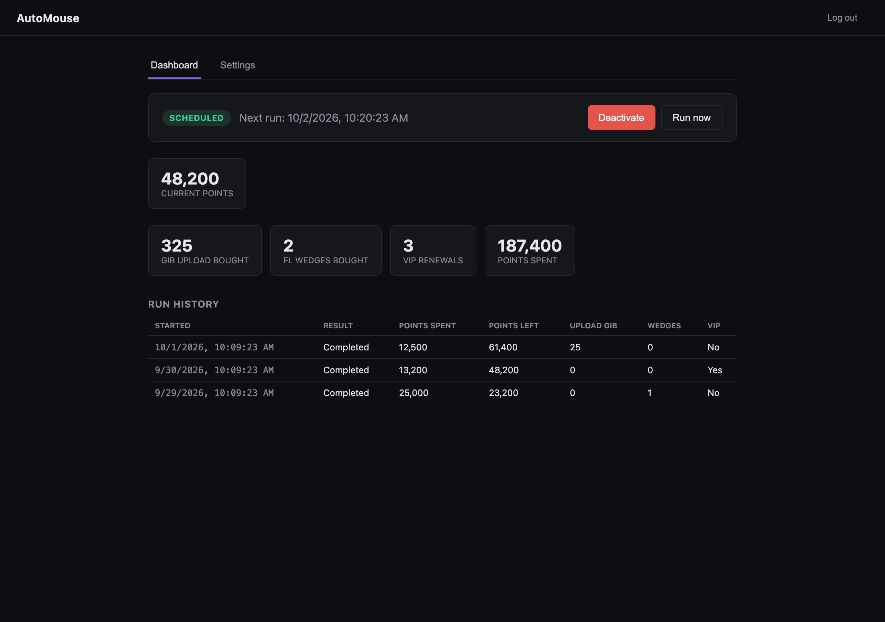
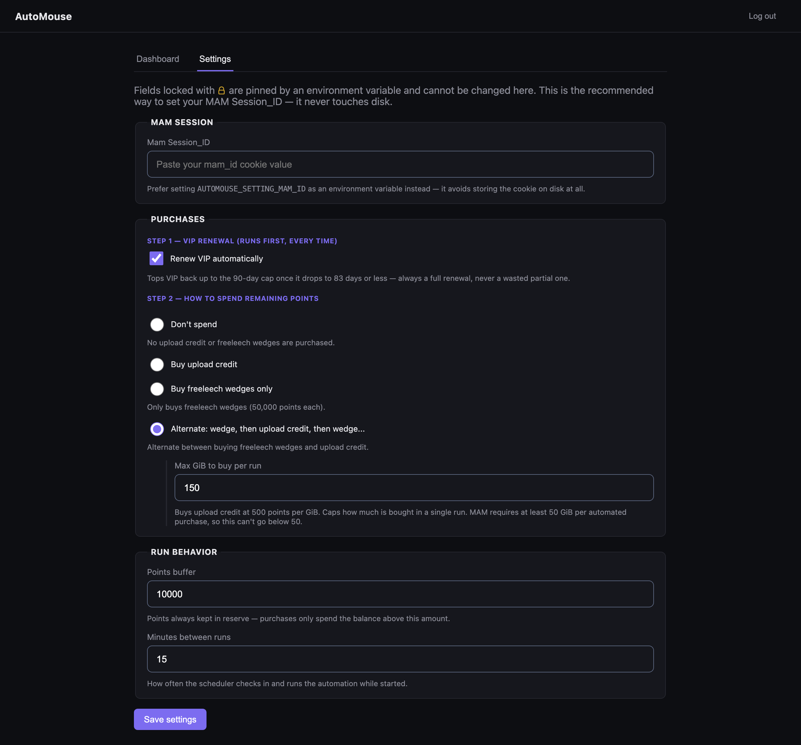

# AutoMouse

**Spend your MyAnonamouse bonus points automatically — VIP renewal, upload
credit and freeleech wedges — from a small self-hosted dashboard.**

Bonus points pile up whether you're paying attention or not, and VIP lapses
if you forget to renew it. AutoMouse watches your balance and spends it on a
schedule, by rules you set, and shows you exactly what it did.



## What it does

- **Renews VIP automatically**, topping up to the 90-day cap once you drop to
  83 days or less — always a full renewal, never a wasted partial one.
- **Buys upload credit and freeleech wedges** on whichever strategy you pick:
  upload only, wedges only, or alternating between the two.
- **Keeps a points buffer you choose**, so it only ever spends the balance
  above your reserve.
- **Records every run** — points before and after, what was bought, whether it
  worked — so you can see what it's been doing.
- **Stops when you tell it to.** Deactivating is a real stop, and the status
  badge always tells you which state you're in.

## Quick start

```yaml
services:
  automouse:
    image: ghcr.io/miista/automouse:latest
    container_name: automouse
    ports:
      - "8765:8765"
    volumes:
      - ./data:/app/data
    environment:
      # Recommended — keeps the cookie out of the config file entirely.
      AUTOMOUSE_SETTING_MAM_ID: "your_mam_id_cookie_value"
    restart: unless-stopped
```

```sh
docker compose up -d
```

Open <http://localhost:8765>, create an admin account, and set your spending
rules.

## Settings

Everything is configurable from the dashboard.



Any setting can also be pinned to an environment variable, which locks it in
the UI so it can't be changed by accident:

```
AUTOMOUSE_SETTING_POINTS_BUFFER=5000
AUTOMOUSE_SETTING_MAM_ID=your_mam_id_cookie_value
```

| Variable | What it does |
| --- | --- |
| `AUTOMOUSE_SETTING_BUY_VIP` | Renew VIP automatically. |
| `AUTOMOUSE_SETTING_UPLOAD_STRATEGY` | `none`, `upload_only`, `wedge_only` or `alternate`. |
| `AUTOMOUSE_SETTING_POINTS_BUFFER` | Never spend below this balance. |
| `AUTOMOUSE_SETTING_MAX_UPLOAD_GB_PER_RUN` | Cap on upload credit per run (MAM's own minimum is 50 GiB). |
| `AUTOMOUSE_SETTING_NEXT_RUN_DELAY_MINUTES` | How long to wait between runs. |
| `AUTOMOUSE_SETTING_MAM_ID` | Your MAM session cookie. |

And a few that aren't settings:

- `AUTOMOUSE_DATA_DIR` — where `config.json` is persisted (default `/app/data`).
- `AUTOMOUSE_AUTH_DISABLED=true` — disables the login entirely. Only for
  loopback-bound deployments, or when you're already fronting the app with
  your own auth and don't want a second login.
- `LOG_LEVEL` — `debug`, `info`, `warn` or `error` (default `info`).

## Security

AutoMouse is a rewrite of
[MAM-Spender-Web-Edition](https://github.com/Plungis/MAM-Spender-Web-Edition).
The original had no authentication on its control API — anyone who could
reach the port could read or replace your session cookie and trigger spends —
stored that cookie in plaintext, and had no CSRF protection.

So this one:

- **Requires an admin account before anything is reachable**, created on
  first launch the way Sonarr and Radarr do it, stored as a bcrypt hash.
- **Checks your session on every route**, read-only state included. Sessions
  survive a restart, so updating the image doesn't sign you out.
- **Rejects cross-origin state changes**, as defense-in-depth alongside the
  login.
- **Keeps your MAM cookie off disk** when you set `AUTOMOUSE_SETTING_MAM_ID`.
  Entered through the UI it's stored `0600`, and the API only ever returns it
  masked to the last 4 characters.
- **Can't leak the cookie into a log line or an API response** — it's wrapped
  in a type whose text and JSON forms are always `[redacted]`, so redaction
  doesn't depend on anyone remembering to scrub it.
- **Only counts a purchase when MAM's own balance confirms it.** An HTTP
  error, a rejected request, or a balance check that doesn't add up is never
  recorded as a successful spend.

The port is published by default and protected by the login, so the dashboard
works without a reverse proxy. Front it with Caddy or Authelia if you'd
rather, or drop the `ports:` block to keep it on the Docker network only.

## Building from source

```sh
make docker          # builds the binary, then the image
```
